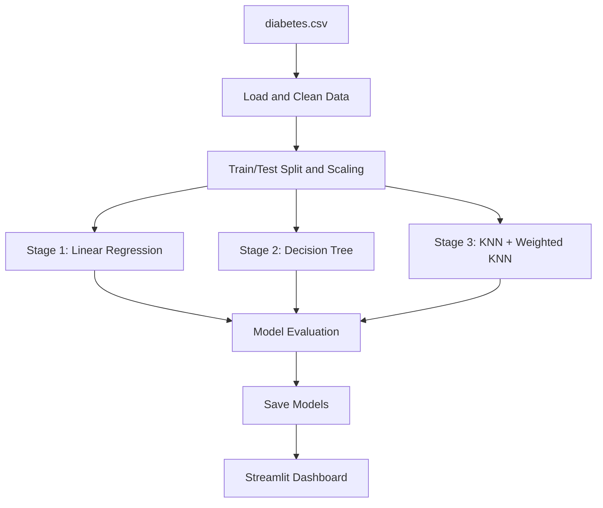

# DiabetaSense — Progressive Diabetes Risk Assessment Platform

End-to-end machine learning platform for **progressive diabetes risk assessment** using the Pima Indians Diabetes Dataset. The system trains a 3-stage ML pipeline (Linear Regression → Decision Tree → KNN), compares models, provides explainability, and presents results through an interactive Streamlit dashboard.

## Key Features

- 3-stage progressive ML pipeline
- Linear Regression for continuous risk scoring
- Decision Tree with Gini vs Entropy comparison
- Manual Information Gain computation
- KNN and Weighted KNN with optimal K selection
- Feature importance and explainability
- Interactive Streamlit dashboard
- Full model persistence with joblib

## Project Structure

```text
diabetes/
  app/              Streamlit dashboard
  data/             Dataset (diabetes.csv from Kaggle)
  models/           Saved trained models
  src/
    preprocess.py         Data loading, cleaning, scaling
    stage1_regression.py  Linear Regression pipeline
    stage2_tree.py        Decision Tree pipeline
    stage3_knn.py         KNN + Weighted KNN pipeline
    evaluate.py           Metrics and comparison table
  train.py          Master training script
  requirements.txt  Python dependencies
```

## ML Pipeline



## Dataset

| Item | Value |
| --- | ---: |
| Source | Pima Indians Diabetes Database (Kaggle/UCI) |
| Total samples | 768 |
| Features | 8 |
| Target | Binary (diabetic / non-diabetic) |

## Models Used

| Stage | Model | Purpose |
| --- | --- | --- |
| Stage 1 | Linear Regression | Continuous risk score |
| Stage 2 | Decision Tree (Gini & Entropy) | Classification + interpretability |
| Stage 3 | KNN + Weighted KNN | Neighbor-based prediction |

## Installation

```bash
git clone https://github.com/yuvaakhil8-dev/Diabetes-ML-Hackathon
cd Diabetes-ML-Hackathon
python -m venv .venv
```

Windows:

```powershell
.\.venv\Scripts\activate
pip install -r requirements.txt
```

Linux/macOS:

```bash
source .venv/bin/activate
pip install -r requirements.txt
```

## Dataset Setup

Download `diabetes.csv` from Kaggle and place it in the `data/` folder:

```text
https://www.kaggle.com/datasets/uciml/pima-indians-diabetes-database
```

## Run Training

```powershell
python train.py
```

This will:
1. Load and preprocess the dataset
2. Train all 3 pipeline stages
3. Evaluate every model on the test set
4. Save all trained models to `models/`
5. Print a final metrics comparison table

## Run Dashboard

```powershell
streamlit run app/dashboard.py
```

## Explainability

The project includes:

- Decision Tree feature importances (sklearn)
- Manual Information Gain computation per feature
- Gini vs Entropy criterion comparison
- KNN optimal K selection curve
- Model metrics comparison table

## Notes

- The `ml_hackathon/` folder contains local Python environment files and is excluded from this repository.
- Large raw video or binary files should not be committed.
- Run `train.py` before launching the dashboard — models must be saved first.
